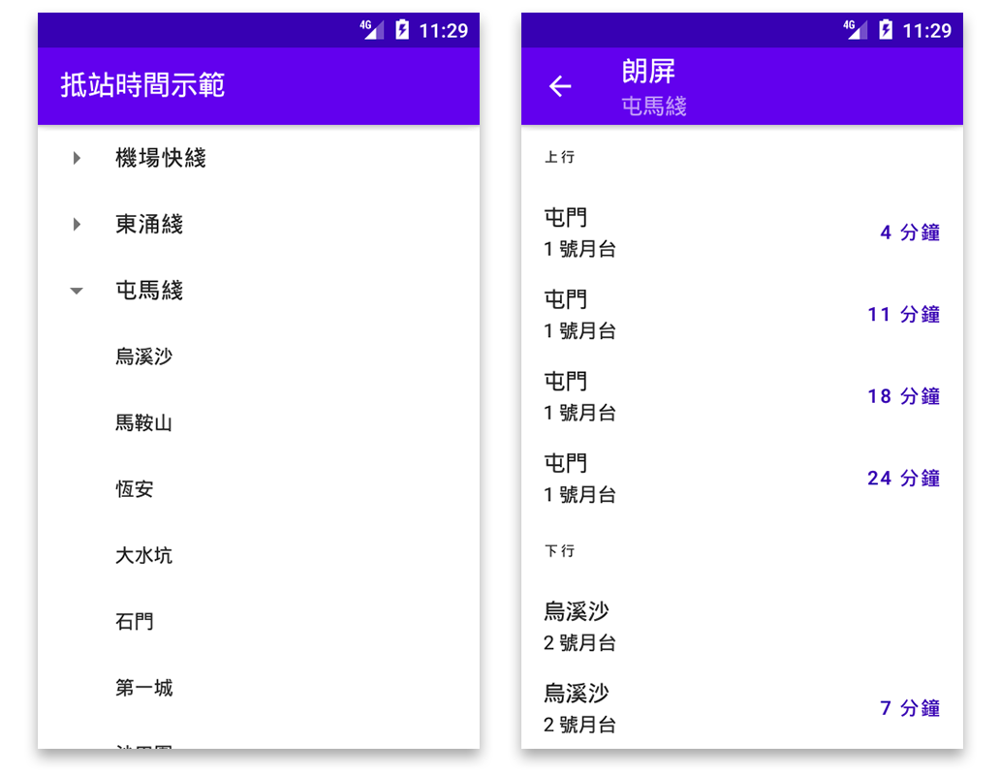

# MTR ETA Demo 港鐵抵站時間示範

This is a sample Android application for the tutorial
series ["寫一個列車抵站時間 Android App"](https://ithelp.ithome.com.tw/users/20139666/ironman/4661).

這是配合 2021 iThome
鐵人賽[「寫一個列車抵站時間 Android App」](https://ithelp.ithome.com.tw/users/20139666/ironman/4661)而準備的 Android
app。

## Used components 使用的組件

- Architecture Components
- View binding
- Data binding
- RecyclerView
- Navigation Components
- Kotlin Coroutines
- Kotlin Flow
- Ktor Client
- Kotlin serialization
- Dagger Hilt

